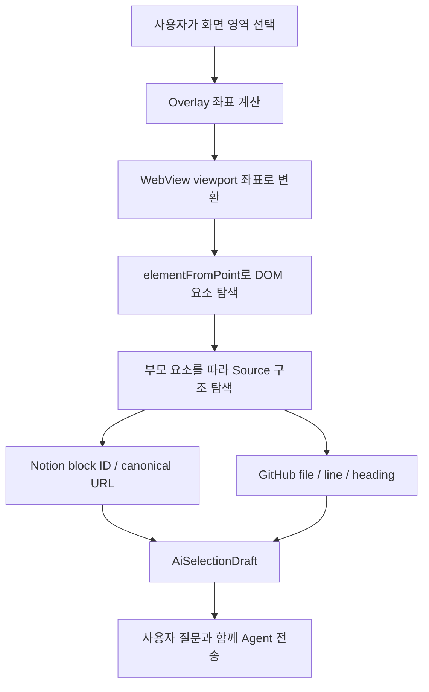

# RAGent 프로젝트 구현 가이드

## 1. 프로젝트 목표

RAGent는 여러 소프트웨어 프로젝트의 GitHub Repository와 Notion 문서를 하나의 지식으로 연결하는 Android 협업 앱이다. 사용자는 프로젝트 원문을 직접 탐색하거나, 최신 프로젝트 정보를 바탕으로 Gemini Agent에게 질문할 수 있다.

핵심 원칙:

- GitHub와 Notion은 공개 링크 연결을 우선한다.
- Android 앱은 화면, 사용자 요청과 개인 API 키 Provider 직접 호출을 담당한다.
- Firebase는 인증, 협업 데이터와 서버 AI 실행을 담당한다.
- 프로젝트 지식과 Vector는 참여자가 Firebase에서 공유한다.
- GitHub API, Notion API와 Webhook은 선택 기능으로 둔다.
- Gemini와 OpenAI만 지원하며 Local LLM은 현재 범위에 포함하지 않는다.

### 하드코딩 금지 — 모든 구현에서 반드시 준수

작성: 2026-08-29 06:13 KST

- 수치, 제한값, 모델명, Provider 설정 등 개발자가 변경할 수 있는 값은 하드코딩하지 않는다.
- 변경 가능한 값은 전체 프로젝트에서 단 하나의 설정 원본(Single Source of Truth)에만 선언한다.
- Android, Cloud Functions, UI 문구와 검증 로직은 설정 원본을 참조해서 사용하며 같은 값을 다른 파일에 중복 작성하지 않는다.
- 사용자 안내 문구에 변경 가능한 수치나 모델명을 직접 적지 않는다. 표시가 필요하면 설정 원본의 값을 읽어 동적으로 구성한다.
- 새 기능을 구현하거나 기존 코드를 수정할 때 중복 상수가 발견되면 공통 설정으로 이동한 뒤 참조하도록 정리한다.

## 2. 현재 구현 상태

### Phase 1 - Android 앱 기반 완료

- Project List와 프로젝트 내부 Navigation
- Overview, Docs, Repository, Members, Agent 화면
- 프로젝트 및 사용자 상세 화면
- Chat과 DM Mock 화면
- 라이트 모드와 다크 모드

### Phase 2 - Firebase 협업 데이터 완료

- Firebase Authentication과 Google 로그인
- Firestore 사용자 정보 저장
- 프로젝트 생성, 조회, 수정, 삭제
- 소유 프로젝트와 참여 프로젝트 통합 조회
- Admin, Member, Viewer 역할 저장과 권한 적용
- 역할별 초대 링크 생성, 재사용과 재발급
- Android App Links 기반 프로젝트 참여
- 멤버 역할 변경, 삭제와 프로젝트 나가기
- 프로젝트 공개 여부 변경
- Firestore Security Rules와 Collection Group 인덱스
- 프로젝트 목록 Pull-to-Refresh

### Phase 3 - AI 연동 및 고도화 (완료, 2026-08-29 06:13 KST)

- Firebase Cloud Functions (TypeScript) 기반 `askAi` Endpoint 구축
- 하이브리드 데이터 흐름: 개인 키는 Android 직접 호출, 개발자 키는 Cloud Function 호출
- iOS 스타일 글래스모피즘 입력창 및 현대적인 채팅 UI 적용
- 프로젝트별 다중 대화 세션 목록화 및 독립된 채팅 화면 (`AgentChatScreen`)
- 마크다운 렌더링 지원 및 AI 응답 메타데이터 표시
- 사용자별 AI 사용량(토큰) 서버 기반 실시간 집계 기초 로직

### Phase 4 - 공개 GitHub·Notion Source 연결 (Step 1~2 완료, 2026-08-30 KST)

#### Step 1: Public Source Link Management와 WebView (완료)

- 프로젝트 상세 화면에서 공개 GitHub·Notion URL 수정 및 원문 열기
- URL 변경 시 서버에 저장된 기존 RAG 정보가 삭제될 수 있음을 경고하고 사용자 확인 후 저장
- Docs·Repository 탭을 Android WebView로 연결하고 GitHub·Notion 간 이동 상태 유지
- Members·Agent 탭 및 Agent 대화 화면 왕복 후에도 WebView 인스턴스와 방문 위치 복원
- WebView 방문 기록이 없을 때 프로젝트 화면이 종료되지 않도록 뒤로가기 처리
- Notion 공개 페이지 표시·스크롤을 위한 전용 CSS 보정
- 상태 표시줄 inset, 공통 헤더 높이, 아이콘 전용 하단 내비게이션과 edge-to-edge WebView 적용

#### Step 2: WebView Source Location Anchoring과 Agent 연결 (완료)

- AI Select 오버레이에서 드래그 영역, 텍스트·이미지 모드, 기존·새 대화 선택 제공
- 선택 테두리의 회전 그라데이션과 비선택 영역의 은은한 AI 처리 효과 적용
- 비선택 영역 터치와 Android 뒤로가기로 선택 취소
- 선택 좌표를 Overlay/Home 좌표에서 WebView viewport 좌표로 변환
- `source_webview.js`의 `elementFromPoint(x, y)`로 실제 화면에 그려진 DOM 요소를 찾고 부모를 탐색
- Notion은 block ID·여러 canonical URL, GitHub는 file path·line range·README heading path 추출
- 선택 결과를 `AiSelectionDraft`로 Agent에 전달하되 바로 전송하지 않고 사용자가 질문을 추가하도록 구성
- 선택 텍스트와 원문 링크를 입력창·메시지 위의 출처 캡션으로 저장하고 다시 열람 가능
- 선택 이미지는 WebView drawing cache 대신 Android Window의 PixelCopy 결과를 선택 영역으로 crop
- 로딩 완료 대기, 단색·빈 Bitmap 감지, 최대 3회 재시도로 잘못된 캡처 방지
- 갤러리 다중 이미지, 파일, 카메라 입력과 함께 Base64 검증 후 Gemini·OpenAI 멀티모달 요청 지원
- 첨부 원본은 Firebase Storage, URI·MIME type·파일명·크기는 Firestore 메시지에 저장
- 전송 없이 화면을 벗어나면 선택 Draft를 폐기하고 선택으로 만든 새 빈 세션도 삭제

Source anchoring의 핵심 흐름은 다음과 같다.



## 3. 현재 Firebase 구조

| 경로 | 용도 |
| --- | --- |
| `users/{uid}` | 사용자 프로필, 누적 input/output/thoughts/total token과 키 출처별 호출 횟수 |
| `users/{uid}/ai_usage/{usageId}` | 요청별 Provider, 모델, 키 출처와 토큰 사용량 |
| `users/{uid}/ai_chats/{projectId}/sessions/{sessionId}` | 프로젝트별 AI 채팅 세션 정보 |
| `users/{uid}/ai_chats/{projectId}/sessions/{sessionId}/messages/{messageId}` | 개별 대화 내역 (하이브리드 저장) |
| `users/{uid}/ai_attachments/{projectId}/{sessionId}/{fileName}` | Agent 첨부 이미지·파일 원본 (Firebase Storage) |
| `projects/{projectId}` | 프로젝트 공용 정보와 연결 URL |
| `projects/{projectId}/members/{uid}` | 사용자 역할과 참여 정보 |
| `projects/{projectId}/invites/{inviteId}` | Member 또는 Viewer 초대 정보 |

## 4. Android와 서버의 책임

### Android 앱

- 로그인과 프로젝트 선택
- 대화 내역 직접 저장 (실시간성 확보)
- 프로젝트 생성 및 관리 UI
- Agent 질문 전송과 답변 표시 (Glassmorphism UI)
- Provider별 개인 API 키 암호화 저장과 Gemini·OpenAI 직접 스트리밍 호출
- GitHub·Notion WebView 수명 주기, 방문 기록과 표시 상태 유지
- AI Select 좌표 변환, JavaScript Bridge 호출과 Source anchor 표시
- PixelCopy 선택 영역 캡처, 첨부 Base64 검증과 Storage 업로드

### Firebase 서버

- 사용자 인증 및 보안 규칙 검증
- Gemini 개발자 키 보호와 `askAi` 스트리밍
- 개인·개발자 키 사용량 서버 집계
- 개발자 키 계정별 설정된 무료 토큰 제한
- 저비용 모델만 선택 가능: Gemini `gemini-3.5-flash-lite`, OpenAI `gpt-5.6-luna`
- 개발자 키 요청의 텍스트·이미지·파일 멀티모달 입력 전달
- 다음 단계에서 공개 Source 접근·변경 상태와 Content Hash 관리

## 5. Phase 3 - AI 연동 및 고도화 상세 스텝

현재 **하이브리드 아키텍처** 기반 Phase 3 구현을 완료했다.

### 스텝 1: UI 고도화 및 기초 연동 (완료)
- `AgentTab` 세션 목록화 및 `AgentChatScreen` 독립
- 글래스모피즘 입력창 및 가변 메시지 버블 구현
- `askAi` 서버 호출 및 기초 메시지 저장 로직 완성

### 스텝 2: 멀티 AI 허브 및 사용량 제한 (완료)
- Gemini·OpenAI Provider 및 Responses API 스트리밍 통합
- Provider별 개인 API 키 Android Keystore 암호화 저장
- 개인 키 Android 직접 호출과 개발자 키 Cloud Function 호출 분리
- 개인·개발자 키 사용량 Firestore 서버 집계
- 개발자 키 계정별 설정된 토큰 제한 (`developerAiTotalTokens` 기준)
- Gemini `gemini-3.5-flash-lite`, OpenAI `gpt-5.6-luna`만 선택 가능
- OpenAI 실제 API 키 테스트는 키 확보 시 진행

### 스텝 3: Android - 상세 통계 및 오류 UX (완료)
- 세션별 누적 토큰 및 유저 전체 통계 실시간 UI 반영
- Provider·개인 키·개발자 키·네트워크·사용량 저장 오류 분류 및 안전한 사용자 안내 완료 (2026-08-29 06:13 KST)
- API 키·권한·모델·쿼터·레이트 리밋·입력·콘텐츠 차단·타임아웃·네트워크·Provider 장애·사용량 동기화 오류 분류 및 안전한 사용자 안내 완료
- 스트리밍 취소 처리와 사용량 동기화 실패 시 답변 보존 처리 완료
- 개발자 토큰 한도는 요청 시작 시 한도 미만이면 답변 완료와 사용량 저장까지 허용하고, 다음 요청부터 차단
- OpenAI 실제 API 키 기기 테스트는 키 확보 후 별도 검증

## 5-1. AgentScreen IME 동반 이동 최종 주의사항

최종 수정: 2026-08-28 22:44 KST
대상 파일: `app/src/main/java/com/yourssu/ragent/ui/agent/AgentScreen.kt`

### 최종 원인

- `imePadding()`은 IME 높이만큼 부모와 `LazyColumn` viewport를 줄이지만, 일반 방향 `LazyColumn`에서 현재 보이는 메시지의 Y 위치까지 자동으로 올려주지는 않는다.
- 따라서 `imePadding()`만 남기면 입력창은 올라가도 메시지는 기존 Y 위치에 남아 화면이 움직이지 않는 것처럼 보인다.
- `requestScrollToItem(lastContentIndex)`를 사용하면 움직이지만, 사용자가 보고 있던 위치를 버리고 마지막 메시지로 강제 이동하므로 요구사항과 다르다.

### 최종 해결 방식 — 반드시 보존

키보드가 열리기 직전의 `firstVisibleItemIndex`와 `firstVisibleItemScrollOffset`을 anchor로 저장한다. IME가 움직이는 동안에는 특정 메시지를 선택하지 않고, 저장한 offset에 현재 `imeBottom`만 더해 현재 화면이 키보드와 같은 거리로 이동하도록 한다.

```kotlin
// app/src/main/java/com/yourssu/ragent/ui/agent/AgentScreen.kt
@Composable
fun AgentChatScreen(/* existing parameters */) {
    val imeBottom = WindowInsets.ime.getBottom(density)
    var previousImeBottom by remember(sessionId) { mutableIntStateOf(imeBottom) }
    var imeAnchorIndex by remember(sessionId) { mutableIntStateOf(0) }
    var imeAnchorOffset by remember(sessionId) { mutableIntStateOf(0) }
    var hasImeAnchor by remember(sessionId) { mutableStateOf(false) }

    SideEffect {
        val capturedNow = imeBottom > 0 && !hasImeAnchor &&
            listState.layoutInfo.totalItemsCount > 0

        if (capturedNow) {
            imeAnchorIndex = listState.firstVisibleItemIndex
            imeAnchorOffset = listState.firstVisibleItemScrollOffset
            hasImeAnchor = true
        }

        if (hasImeAnchor && (capturedNow || imeBottom != previousImeBottom)) {
            listState.requestScrollToItem(
                index = imeAnchorIndex,
                scrollOffset = imeAnchorOffset + imeBottom
            )
        }

        if (imeBottom == 0) hasImeAnchor = false
        previousImeBottom = imeBottom
    }
}
```

실제 기기 `SM-X820 / Android 16` 확인 결과, IME와 입력창이 `871px` 올라갈 때 동일 메시지도 정확히 `871px` 올라갔다.

### 절대 변경 금지

- 위 anchor 기반 IME 로직을 삭제하거나 `requestScrollToItem(lastContentIndex)`로 바꾸지 않는다.
- IME 표시 시 `animateScrollToItem()` 또는 `delay()`를 사용하지 않는다.
- `reverseLayout` 또는 `messages.asReversed()`를 적용해 기존 메시지 순서와 첫 메시지 상단 배치를 바꾸지 않는다.
- `AgentScreen.kt`의 다른 UI를 함께 수정하지 않는다.
- `AgentChatHeader`와 `ChatInputArea`의 색상, 투명도, 테두리, 그림자, 모양, padding을 변경하지 않는다.
- 공통 Theme, 색상 정의, Gradle, Manifest 및 다른 화면 파일을 키보드 문제와 함께 수정하지 않는다.

### 수정 전 필수 확인

- 정상 참고 구현: `C:\Users\baejunsung\AndroidStudioProjects\AgentChatUISample\app\src\main\java\com\b6star\chatui\ui\AgentScreen.kt`
- 수정 전후 `git diff -- AgentScreen.kt`로 IME 관련 코드 외 변경이 없는지 확인한다.
- `./gradlew.bat :app:compileDebugKotlin`을 실행하고 실제 기기에서 현재 스크롤 위치 기준 동반 이동을 확인한다.
- 실제 기기 확인 전에는 해결 완료로 기록하지 않는다.

## 6. 이후 개발 순서

### Phase 4 - 공개 GitHub·Notion Source 연결
- Step 1 완료: 공개 URL 관리와 Docs·Repository WebView
- Step 2 완료: 화면 선택, Source 위치 anchoring, Agent 텍스트·이미지 첨부
- Step 3 예정: Source 접근 상태, 마지막 확인 시각, Content Hash와 중복 확인 방지
- Step 4 예정: 공통 Document·Metadata 모델로 후속 RAG 입력 준비

### Phase 5 - Provider-agnostic RAG 기반
- 변경된 Source만 Chunking 및 Embedding
- Firestore Vector Search (Top-K Retrieval)
- 프로젝트 권한에 맞는 Source 필터링

### Phase 6 - RAG Agent
- 검색 Context를 사용자가 선택한 Gemini 또는 OpenAI 모델에 연결
- 답변 출처와 원문 위치 표시

## 10. 현재 작업 위치

- 완료: Phase 1, Phase 2, Phase 3, Phase 4 Step 1~2
- Phase 3 종료일: **2026-08-29 06:13 KST**
- Phase 4 Step 2 종료일: **2026-08-30 KST**
- 다음 작업: **Phase 4 Step 3 / Public Source Sync Status**

### 새 대화 시작용 다음 작업 요약

목표는 아직 Source 본문을 Chunking하거나 Embedding하는 것이 아니라, 연결된 공개 GitHub·Notion Source를 서버가 안전하게 확인하고 상태를 공유하는 것이다.

1. Cloud Function에 GitHub·Notion 공개 URL 접근 확인 로직을 추가한다.
2. `projects/{projectId}` 또는 Source 하위 문서에 `status`, `lastCheckedAt`, `lastChangedAt`, `contentHash`, `lastError`를 저장한다.
3. 동일 URL을 짧은 시간 안에 반복 확인하지 않도록 dedupe와 throttle 정책을 둔다.
4. 프로젝트 UI에 확인 중·정상·변경됨·오류 상태, 마지막 확인 시각과 재시도 동작을 표시한다.
5. 접근 확인과 Content Hash 비교를 검증한 뒤 Step 4의 공통 Document·Metadata 정규화로 넘어간다.

다음 작업에서 반드시 보존할 사항:

- 공개 URL 우선 원칙과 Admin 수정 권한
- WebView 인스턴스·방문 위치·뒤로가기 동작
- `source_webview.js`의 Notion/GitHub 분리 추출 로직과 기존 anchor 필드
- PixelCopy crop 좌표와 빈·단색 이미지 재시도
- 전송하지 않은 Selection Draft 및 새 빈 세션 정리
- 첨부당 10MB, 요청 합계 20MB 제한과 Base64 유효성 검사
- 기존 AgentScreen IME anchor 동반 이동 로직
