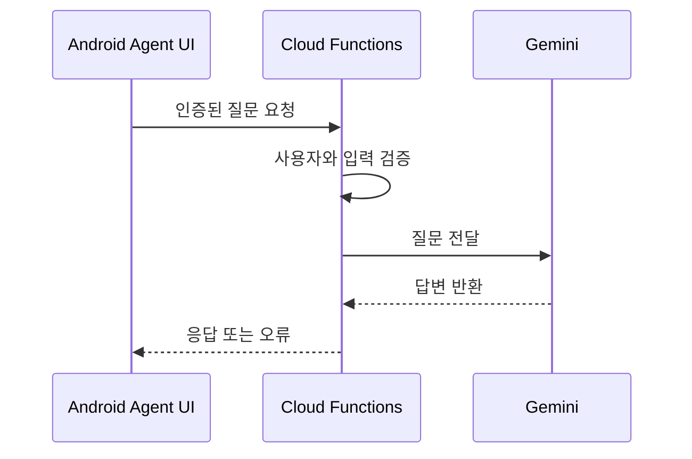
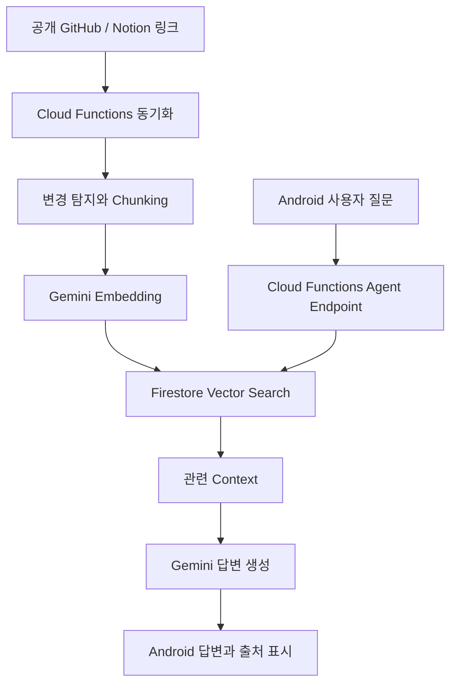

# RAGent 프로젝트 구현 가이드

## 1. 프로젝트 목표

RAGent는 여러 소프트웨어 프로젝트의 GitHub Repository와 Notion 문서를 하나의 지식으로 연결하는 Android 협업 앱이다. 사용자는 프로젝트 원문을 직접 탐색하거나, 최신 프로젝트 정보를 바탕으로 Gemini Agent에게 질문할 수 있다.

핵심 원칙:

- GitHub와 Notion은 공개 링크 연결을 우선한다.
- Android 앱은 화면과 사용자 요청을 담당한다.
- Firebase는 인증, 협업 데이터와 서버 AI 실행을 담당한다.
- 프로젝트 지식과 Vector는 참여자가 Firebase에서 공유한다.
- GitHub API, Notion API와 Webhook은 선택 기능으로 둔다.
- Local LLM과 다른 AI Provider는 현재 범위에 포함하지 않는다.

## 2. 현재 구현 상태

### Phase 1 - Android 앱 기반 완료

- Project List와 프로젝트 내부 Navigation
- Overview, Docs, Repository, Members, Agent 화면
- 프로젝트 및 사용자 상세 화면
- Chat과 DM Mock 화면
- 라이트 모드와 다크 모드

### Phase 2 - Firebase 협업 데이터 완료

- Firebase Authentication과 Google 로그인
- Firestore 사용자 정보 저장
- 프로젝트 생성, 조회, 수정, 삭제
- 소유 프로젝트와 참여 프로젝트 통합 조회
- Admin, Member, Viewer 역할 저장과 권한 적용
- 역할별 초대 링크 생성, 재사용과 재발급
- Android App Links 기반 프로젝트 참여
- 멤버 역할 변경, 삭제와 프로젝트 나가기
- 프로젝트 공개 여부 변경
- Firestore Security Rules와 Collection Group 인덱스
- 프로젝트 목록 Pull-to-Refresh

## 3. 현재 Firebase 구조

| 경로 | 용도 |
| --- | --- |
| `users/{uid}` | 로그인 사용자 프로필 |
| `projects/{projectId}` | 프로젝트 공용 정보와 연결 URL |
| `projects/{projectId}/members/{uid}` | 사용자 역할과 참여 정보 |
| `projects/{projectId}/invites/{inviteId}` | Member 또는 Viewer 초대 정보 |
| `projects/{projectId}/comments/{commentId}` | 프로젝트 댓글 |

### 역할 권한

| 기능 | Admin | Member | Viewer |
| --- | --- | --- | --- |
| 프로젝트 조회 | 가능 | 가능 | 가능 |
| 프로젝트 관리 | 가능 | 불가 | 불가 |
| 초대 및 멤버 관리 | 가능 | 불가 | 불가 |
| 댓글 작성 | 가능 | 가능 | 가능 |
| 프로젝트 나가기 | 불가 | 가능 | 가능 |

Admin은 강등하거나 일반 멤버 관리 기능으로 삭제할 수 없다. Member와 Viewer는 서로 역할을 변경할 수 있으며 이 작업은 Admin만 수행한다.

## 4. Android와 서버의 책임

### Android 앱

- 로그인과 프로젝트 선택
- 프로젝트 생성 및 관리 UI
- 초대 링크 공유와 참여 확인
- Docs 및 Repository 탐색 UI
- Agent 질문 전송과 답변 표시

### Firebase 서버

- 사용자 인증 확인
- 프로젝트와 멤버 권한 검증
- Gemini 요청의 비밀키 보호
- 사용자별 요청 제한
- Source 동기화, Chunking과 Embedding
- Vector 검색과 Gemini 답변 생성

Android 앱에서 Gemini 비밀키를 직접 관리하지 않는다.

## 5. Phase 3 - Gemini AI 기본 연동

다음 Phase의 목표는 Agent 화면에서 질문을 보내고 Gemini 답변을 받는 최소 서버 흐름을 완성하는 것이다. GitHub 및 Notion RAG는 이 Phase에 한꺼번에 포함하지 않는다.

구현 범위:

1. Firebase Blaze 전환과 TypeScript Cloud Functions 구성
2. 인증된 Agent 질문 Endpoint 추가
3. Gemini 생성 모델 연결
4. 입력 검증, 오류 처리와 기본 요청 제한
5. Agent 화면에 로딩, 성공과 실패 상태 연결

완료 기준:

- 로그인 사용자만 질문할 수 있다.
- Gemini 비밀키가 Android 앱에 포함되지 않는다.
- Agent 화면에서 질문과 답변을 확인할 수 있다.
- 네트워크 및 서버 오류가 사용자에게 표시된다.
- RAG가 없는 기본 답변임을 코드와 문서에서 구분한다.

## 6. 이후 개발 순서

### Phase 4 - 공개 Source 연결

- 공개 GitHub Repository URL 수집
- 공개 Notion Page URL 수집
- Docs WebView와 Repository 탐색 연결
- Source 확인 시각과 콘텐츠 Hash 저장
- 프로젝트 진입 시 서버 동기화 요청

### Phase 5 - RAG 연결

- 변경된 Source만 Chunking
- Gemini Embedding 생성
- Firestore Vector Search
- 질문별 관련 Chunk Top-K 검색
- 프로젝트 참여자 간 RAG 데이터 공유

### Phase 6 - Gemini RAG Agent

- 검색 Context를 Gemini Prompt에 연결
- 답변 출처 표시
- 응답 품질과 비용 점검
- 필요하면 Streaming 응답 추가

### 선택 기능

- GitHub API와 Webhook
- Notion API
- 다른 Cloud LLM Provider
- Local LLM

## 7. 목표 데이터 흐름

## 8. RAG 데이터 기준

각 Chunk에는 최소한 다음 Metadata를 저장한다.

- `projectId`
- `sourceType`
- `sourceName`
- `filePath` 또는 `pageName`
- `content`
- `embedding`
- `sourceVersion`
- `contentHash`

변경되지 않은 Source는 다시 Embedding하지 않는다. 프로젝트 전체를 매 질문마다 Gemini에 전달하지 않고 관련 Chunk만 Context로 사용한다.

## 9. 구현 원칙

- 현재 Phase의 완료 기준에 필요한 코드만 추가한다.
- 앱 UI, Firebase 데이터와 AI 서버 책임을 분리한다.
- 보안과 권한은 UI가 아니라 Firestore Rules와 서버에서도 검증한다.
- 실제 코드와 문서가 다르면 최신 GitHub 코드와 Open PR을 우선한다.
- 새 Phase를 시작하기 전에 이전 Phase PR을 `main`에 병합한다.

## 10. 현재 작업 위치

- 완료: Phase 1
- 구현 완료, 병합 대기: Phase 2 / PR #4
- 다음 작업: Phase 3 / Gemini AI 기본 연동
