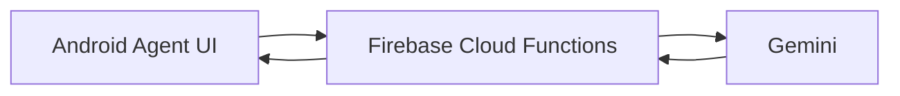
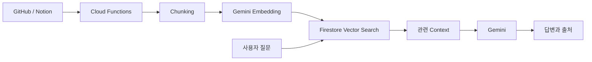

# RAGent

RAGent는 GitHub Repository와 Notion 문서를 프로젝트 지식으로 연결하고, Gemini 기반 AI Agent를 통해 코드와 문서를 탐색하고 질문할 수 있도록 만드는 Android 애플리케이션입니다.

## 현재 구현

- Firebase Authentication 기반 Google 로그인
- Firestore 사용자 및 프로젝트 저장
- 프로젝트 생성, 조회, 수정, 삭제
- Admin, Member, Viewer 역할 관리
- Member 및 Viewer 초대 링크 발급과 재발급
- Android App Links 기반 프로젝트 참여
- 소유 프로젝트와 참여 프로젝트 통합 조회
- Firestore Security Rules 및 Collection Group 인덱스
- 프로젝트 목록 Pull-to-Refresh

Phase 2 구현은 완료되었으며 PR #4 병합을 앞두고 있습니다. 다음 Phase에서는 Gemini AI 기본 연동을 시작합니다.

## 다음 Phase

Phase 3의 목표는 RAG를 한 번에 완성하는 것이 아니라, 인증된 사용자의 질문을 Firebase 서버가 받아 Gemini 답변을 반환하는 최소 흐름을 먼저 만드는 것입니다.

Phase 3 이후 공개 GitHub 및 Notion 링크 수집, Chunking, Embedding, Firestore Vector Search를 순서대로 연결합니다.

## 목표 구조

GitHub와 Notion은 공개 링크 연결을 기본으로 사용합니다. GitHub API, Notion API와 Webhook은 필요한 경우 선택 기능으로 추가합니다.

## 기술 스택

- Kotlin
- Jetpack Compose
- Firebase Authentication
- Cloud Firestore
- Firebase Hosting
- Firebase Cloud Functions
- Gemini

## 문서

- [프로젝트 구현 가이드](RAGENT_PROJECT_GUIDE.md)
- [Phase 2 작업 기록](docs/steps/README.md)
