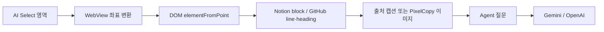
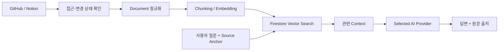

# RAGent

RAGent는 공개 GitHub Repository와 Notion 문서를 프로젝트 지식으로 연결하고, 사용자가 선택한 AI Provider를 통해 코드와 문서를 탐색하고 질문할 수 있도록 만드는 Android 협업 애플리케이션입니다.

## 현재 구현

### 프로젝트와 협업

- Firebase Authentication 기반 Google 로그인
- Firestore 사용자 및 프로젝트 저장
- 프로젝트 생성, 조회, 수정, 삭제
- Admin, Member, Viewer 역할 및 초대 링크 관리
- Android App Links 기반 프로젝트 참여
- 소유 프로젝트와 참여 프로젝트 통합 조회
- Firestore Security Rules 및 Collection Group 인덱스

### AI Agent

- 프로젝트별 대화 세션 목록과 독립된 채팅 화면
- Gemini·OpenAI 멀티 Provider 스트리밍
- 개인 API 키 Android 직접 호출과 개발자 키 Cloud Functions 호출 분리
- Provider별 사용량 집계, 토큰 제한 및 오류 UX
- 갤러리 다중 선택, 파일, 카메라 첨부
- 첨부 파일 Base64 검증 및 Gemini·OpenAI 멀티모달 전송
- Firebase Storage 원본 저장과 Firestore 메시지 메타데이터 저장
- 채팅 이미지 목록, 전체 화면 미리보기, 파일 크기 표시

### GitHub·Notion Source

- 프로젝트 상세 화면에서 공개 GitHub·Notion 링크 수정 및 원문 열기
- 링크 변경 시 기존 RAG 정보 삭제 경고
- Docs·Repository WebView와 탭·화면 이동 후 상태 복원
- WebView 내부 뒤로가기 처리와 Notion 전용 표시 보정
- AI Select 오버레이의 텍스트·이미지 선택 모드
- 화면 좌표를 WebView DOM 위치로 변환하는 JavaScript Bridge
- Notion block ID·canonical URL과 GitHub 파일·코드 줄·README heading 추출
- 여러 Notion block 및 GitHub line 범위의 원문 링크 저장
- 선택 텍스트를 출처 캡션으로, 선택 이미지를 PixelCopy 캡처로 Agent 입력에 첨부
- 기존 대화 또는 새 대화를 선택한 뒤 별도의 질문을 작성해 전송
- 전송하지 않은 선택 Draft와 새 빈 대화 자동 정리

Phase 1~3과 Phase 4 Step 1~3.3의 코드 구현이 완료되었습니다.

## 현재 Phase

**Phase 4 Step 3: Public Link Source Sync**의 코드 구현을 완료했습니다. 프로젝트 진입 요청은 인증·멤버 확인·throttle·transaction lease를 거쳐 Cloud Tasks 작업 하나로 바뀝니다. GitHub는 공개 Git 프로토콜로, Notion은 private Cloud Run의 Playwright·Chromium으로 수집하며 항목별 SHA-256과 전체 manifest를 Firebase Storage snapshot 및 Firestore revision 상태로 저장합니다. 실제 Cloud Run·Functions 배포와 IAM 설정은 아직 남아 있으며, 다음 구현은 Step 4 공통 Document·Metadata 정규화입니다.

## 목표 구조

GitHub와 Notion은 공개 링크 연결을 기본으로 사용합니다. GitHub API, Notion API와 Webhook은 필요한 경우 선택 기능으로 추가합니다.

## 기술 스택

- Kotlin, Jetpack Compose, Android WebView, JavaScript Bridge, PixelCopy
- Firebase Authentication, Cloud Firestore, Cloud Storage
- Firebase Hosting, Firebase Cloud Functions
- Gemini, OpenAI

## 문서

- [프로젝트 구현 가이드](RAGENT_PROJECT_GUIDE.md)
- [단계별 작업 기록](docs/steps/README.md)
