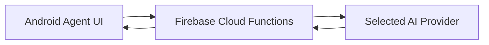
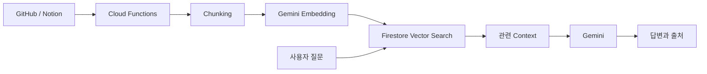

# RAGent

RAGent는 GitHub Repository와 Notion 문서를 프로젝트 지식으로 연결하고, Gemini 기반 AI Agent를 통해 코드와 문서를 탐색하고 질문할 수 있도록 만드는 Android 애플리케이션입니다.

## 현재 구현

- Firebase Authentication 기반 Google 로그인
- Firestore 사용자 및 프로젝트 저장
- 프로젝트 생성, 조회, 수정, 삭제
- Admin, Member, Viewer 역할 관리
- Member 및 Viewer 초대 링크 발급과 재발급
- Android App Links 기반 프로젝트 참여
- 소유 프로젝트와 참여 프로젝트 통합 조회
- Firestore Security Rules 및 Collection Group 인덱스
- 프로젝트 목록 Pull-to-Refresh
- Agent 채팅 UI 및 세션 목록
- Gemini, OpenAI, Anthropic 멀티 Provider 스트리밍
- 개인 API 키 직접 호출과 개발자 키 Cloud Functions 호출 분리
- Provider별 사용량 집계, 토큰 제한 및 오류 UX

Phase 1~3 구현이 완료되었습니다. Phase 3에서는 멀티 Provider AI 연동, 스트리밍, 사용량 통계, 토큰 제한, 오류 UX까지 반영했습니다.

## 현재 Phase

다음 작업은 Phase 4 공개 GitHub·Notion Source 연결입니다. 공개 URL 검증·정규화, Docs·Repository 열람, Source 상태 관리와 후속 RAG 입력을 준비합니다.

Phase 4 이후 변경된 Source만 Chunking 및 Embedding하고, Firestore Vector Search와 RAG Agent를 순서대로 연결합니다.

## 목표 구조

GitHub와 Notion은 공개 링크 연결을 기본으로 사용합니다. GitHub API, Notion API와 Webhook은 필요한 경우 선택 기능으로 추가합니다.

## 기술 스택

- Kotlin
- Jetpack Compose
- Firebase Authentication
- Cloud Firestore
- Firebase Hosting
- Firebase Cloud Functions
- Gemini

## 문서

- [프로젝트 구현 가이드](RAGENT_PROJECT_GUIDE.md)
- [Phase 2 작업 기록](docs/steps/README.md)
